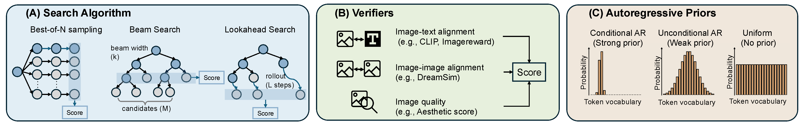

# 🧩 Search over Tokens (`SoTo`)
[🌐 Website](https://soto.epfl.ch) | [📄 arXiv](https://arxiv.org/abs/2604.15453) | [🤗 Models](https://huggingface.co/collections/EPFL-VILAB/ar-models-with-flextok) | [📚 BibTeX](#citation)

`SoTo` is a framework for **test-time search in autoregressive (AR) image generation**, decoupling [AR priors](#ar-priors), [search algorithms](#search-algorithms), and [verifiers](#verifiers) for flexible composition via simple YAML configs.

---

This is the official implementation of:

**[(1D) Ordered Tokens Enable Efficient Test-Time Search](#)** <br>
*[Zhitong Gao](https://gaozhitong.github.io/), [Parham Rezaei](https://rezaei-parham.github.io/), [Ali Cy](https://www.ali.cy/), [Mingqiao Ye](https://ymq2017.github.io/), [Nataša Jovanović](https://people.epfl.ch/natasa.jovanovic?lang=en), [Jesse Allardice](https://github.com/JesseAllardice), [Afshin Dehghan](https://scholar.google.com/citations?user=wcX-UW4AAAAJ), [Amir Zamir](https://vilab.epfl.ch/zamir/), [Roman Bachmann](https://roman-bachmann.github.io/), [Oğuzhan Fatih Kar](https://ofkar.github.io/)* <br>
<sup>EPFL &nbsp;&nbsp;&nbsp; Apple</sup>


> TL;DR: We find that 1D ordered tokens (e.g., [FlexTok](https://github.com/apple/ml-flextok)) provide a coarse-to-fine structure with semantically interpretable intermediate readouts, enabling more efficient test-time scaling than classical 2D grid tokenizers. We further show that this structure enables training-free text-to-image generation via pure token search, and systematically study the roles of different search algorithms, verifiers, and AR priors.

---

Building on this study, we release `SoTo`, a modular framework for test-time search in autoregressive image generation, designed to support the broader research community.

`SoTo` supports:
- **AR Priors**: FlexTok AR series, Janus series, Infinity, Uniform prior — [see all](docs/ar_priors.md)
- **Search Algorithms**: Beam search, lookahead search, best-of-N — [see all](docs/search_algorithms.md)
- **Verifiers**: CLIP, ImageReward, HPSv2, Likelihood, Grounded SAM, DreamSim, and [more (10 total)](docs/verifiers.md)
- **Extensible**: flexibly combine existing components or integrate new ones — [how to](docs/extension.md)

We also provide [multi-GPU scripts](docs/eval.md) and [notebooks](notebooks/) walking through the main components and key findings.



---

## Table of Contents

- [Installation](#installation)
- [Quick Start](#quick-start)
- [Code Structure](#code-structure)
- [FlexTok AR Models](#flextok-ar-models)
- [SoTo Framework](#soto-framework)
  - [AR Priors](#ar-priors)
  - [Search Algorithms](#search-algorithms)
  - [Verifiers](#verifiers)
  - [Running Experiments](#running-experiments)
  - [Extending the Framework](#extending-the-framework)
- [License](#license)
- [Citation](#citation)
- [Acknowledgements](#acknowledgements)

---

## Installation

```bash
git clone https://github.com/EPFL-VILAB/search-over-tokens.git
cd search-over-tokens

conda create -n soto python=3.10 -y
conda activate soto

pip install -e .
# Install ImageReward without its pinned transitive deps.
# This keeps the env compatible with FlexTok/L3M.
pip install image-reward --no-deps
```

Optional for notebooks:

```bash
pip install ipykernel
python -m ipykernel install --user --name soto --display-name "SoTo (soto)"
```

Default install includes:
- FlexTok-based AR generation (`flextok`, `l3m`, and the bundled `flextok_ar` Python package exposed by this repo)
- Default verifier stack: CLIP, ImageReward, DreamSim, and imscore-based verifiers
- Core SoTo search framework dependencies

Other options:

```bash
# Spatial verifier stack (GroundingDINO + SAM related deps; slower/heavier install)
pip install -e '.[spatial]'

# Janus support
pip install -e '.[janus]'

# Infinity support
pip install -e '.[infinity]'
```

If you want every optional backend, install the default stack first and then:

```bash
pip install -e '.[all]'
```

If you only want the standalone FlexTok AR package, use [`flextok_ar/README.md`](flextok_ar/README.md)。

---

## Quick Start

### Run test-time search in ~10 lines

```python
from soto.ar_priors.base import ARPriorFactory
from soto.search_algorithms.base import SearchAlgorithmFactory
from soto.verifiers.base import VerifierFactory

# 1. Define AR model, verifier, and search algorithm
ar_prior = ARPriorFactory.create("flextok_ar_3b", device="cuda")  # auto-loads EPFL-VILAB/FlexAR-3B-T2I

verifier = VerifierFactory.create("image_reward", device="cuda")

search = SearchAlgorithmFactory.create("beam", ar_prior=ar_prior, verifier=verifier, config={
    "beam_width": 5,
    "candidates_per_beam": 10,
    "max_steps": 9,
})

# 2. Run search
result = search.search("A cat sitting on a windowsill", num_results=1)

# 3. See results
result.images[0].save("example.png")
print(f"Score: {result.scores[0]:.4f}")
```


### Notebooks

We recommend checking out the Jupyter notebooks in [`notebooks/`](notebooks/) to get started with the code base.

| Notebook | Description |
|----------|-------------|
| [`01_quickstart.ipynb`](notebooks/01_quickstart.ipynb) | Visualize FlexTok's coarse-to-fine generation; run best-of-N, beam, and lookahead search; compare FlexTok (1D ordered) vs GridTok (2D raster) to see concretely why token order matters for search. |
| [`02_ar_free_search.ipynb`](notebooks/02_ar_free_search.ipynb) | Explore FlexTok's visual token vocabulary; then generate images via pure token search over a uniform prior, no AR model required. |
| [`03_verifiers.ipynb`](notebooks/03_verifiers.ipynb) | Steer generation toward a reference image with DreamSim; compare all 9 verifiers side-by-side on the same prompt; combine them with the ensemble verifier. |
| [`04_other_ar_models.ipynb`](notebooks/04_other_ar_models.ipynb) | Run best-of-N, beam, and lookahead search on Janus-Pro 7B and Infinity 2B, demonstrating SoTo generalizes across AR model families. |

### From the command line

We provide configuration files for large-scale and long-running jobs, including dataset-based evaluations.

```bash
# Beam search with FlexTok + ImageReward on GenEval
# Single-GPU
python soto/run_search.py --config-name eval/flextok/geneval_flextok_ar_3b_beam_ir

# Multi-GPU: each GPU processes different prompts independently — no synchronization needed
torchrun --nproc_per_node=4 soto/run_search.py --config-name eval/flextok/geneval_flextok_ar_3b_beam_ir

# Custom prompts (override dataset with inline prompts)
python soto/run_search.py \
    --config-name eval/flextok/geneval_flextok_ar_3b_beam_ir \
    prompts='["A golden retriever in snow", "A red car on a highway"]'
```

---
## Code Structure
This repository consists of two main components: (1) FlexTok Autoregressive (AR) Models and (2) Search-over-Tokens (SoTo) Framework. The overall structure is shown below:

```
├── flextok_ar/                 # FlexTok AR package (standalone installable)
├── soto/
│   ├── ar_priors/              # AR model wrappers
│   ├── search_algorithms/      # Search strategies
│   ├── verifiers/              # Verifiers
│   ├── data/                   # Dataset loaders (auto-download)
│   ├── utils/
│   ├── configs/
│   │   ├── components/         # Default configs for each AR model, algorithm, and verifier
│   │   │   ├── ar_priors/
│   │   │   ├── search_algorithms/
│   │   │   └── verifiers/
│   │   └── eval/               # Ready-to-run experiment configs
│   ├── run_search.py           # Main entry point
│   └── scripts/                # Shell script shortcuts
│       ├── run.sh
│       ├── run_ddp.sh
│       └── ...
├── notebooks/                  # Jupyter notebooks
└── docs/                       # Detailed documentation
```
---
## FlexTok AR Models
We provide a collection of FlexTok autoregressive (AR) models in the [`flextok_ar`](flextok_ar) directory. The FlexTok AR module is implemented as a standalone installable package. If you only need autoregressive image generation without test-time search, you can install and use this package independently. 

We also provide quick-start scripts for basic usage. Please refer to [`flextok_ar/README.md`](flextok_ar/README.md) for detailed instructions.

---
## SoTo Framework
The SoTo framework decouples test-time search for image generation into three independently swappable components. Each component is instantiated by name through YAML configuration files, making the framework modular and easily extensible.

| Component | Base Class | What It Does |
|-----------|-----------|-------------|
| **AR Prior** | `BaseARPrior` | Generates token sequences (the "model") |
| **Search Algorithm** | `BaseSearchAlgorithm` | Explores the token space (the "strategy") |
| **Verifier** | `BaseVerifier` | Scores generated images (the "reward") |

Below we provide a brief introduction to each component.

### AR Priors

`SoTo` wraps multiple AR image generation models behind a unified `BaseARPrior` interface. Each model is registered by name and instantiated from a YAML config.

| Name | Model | Notes |
|------|-------|-------|
| `flextok_ar_3b` | FlexAR-3B | Primary model from paper; 1D ordered tokens. Variants: `flextok_ar_1b`, `flextok_ar_382m`, `flextok_ar_113m` |
| `gridtok_ar_3b` | GridAR-3B | AR models trained on 2D grid tokenizer (controlled baseline for FlexAR-3B) |
| `janus_pro` | Janus Pro 7B | Powerful AR models trained on 2D grid tokenizer. Variants: `janus`.|
| `infinity` | Infinity 2B | Multi-scale BSQ tokens |
| `uniform` | — | Uniform random tokens (for experiments on ar-free search) |

See [docs/ar_priors.md](docs/ar_priors.md) for the full list and config format.

---

### Search Algorithms

`SoTo` provides three search strategies, all implementing `BaseSearchAlgorithm`.

| Name | Description |
|------|-------------|
| `best_of_n` | Generate N complete sequences, return the best |
| `beam` | Maintain top-K beams, score after each token step |
| `lookahead` | Like beam, but AR-complete partial sequences before scoring |

See [docs/search_algorithms.md](docs/search_algorithms.md) for parameters and per-model configurations.

---

### Verifiers

Verifiers score generated images and guide search. All implement `BaseVerifier` and work in ensembles.

| Name | What It Scores |
|------|---------------|
| `clip` | CLIP image-text similarity |
| `image_reward` | Learned human-preference alignment |
| `aesthetic` | Aesthetic quality |
| `pickscore` | Pick-a-Pic human preference |
| `hpsv2` | Human Preference Score v2 |
| `cyclereward` | Cycle-consistent reward |
| `likelihood` | AR log-probability |
| `grounded_sam` | Spatial compositionality (counting, colors, relations) |
| `dreamsim` | Perceptual similarity to reference image |
| `ensemble` | Combines any of the above |

See [docs/verifiers.md](docs/verifiers.md) for ensemble configuration and all verifier options.

---

### Running Experiments

All configuration is Hydra-based. Experiments compose an AR prior, search algorithm, verifier, and dataset from YAML configs.

```bash
bash soto/scripts/run.sh              # FlexTok beam search on GenEval (single GPU)
bash soto/scripts/run_ddp.sh 4        # Same, 4 GPUs
bash soto/scripts/run_bon.sh          # Best-of-50
bash soto/scripts/run_janus_pro.sh    # Janus Pro
bash soto/scripts/run_infinity.sh     # Infinity
```

See [docs/eval.md](docs/eval.md) for CLI overrides, custom eval configs, and dataset details.

---

### Extending the Framework

Each new component requires only three steps: subclass the base class, implement the abstract methods, register with the factory decorator.

See [docs/extension.md](docs/extension.md) for full examples of adding new AR models, search algorithms, and verifiers.

---

## License

The code in this repository is released under the Apache 2.0 license as found in the [LICENSE](LICENSE) file.

Model weights are released under the Apache 2.0 license.

---

## Citation

If you find this work helpful, please consider citing:

```bibtex
@article{soto,
  title={(1D) Ordered Tokens Enable Efficient Test-Time Search},
  author={Zhitong Gao and Parham Rezaei and Ali Cy and Mingqiao Ye and Nata\v{s}a Jovanovi\'{c} and
          Jesse Allardice and Afshin Dehghan and Amir Zamir and Roman Bachmann and
          O\u{g}uzhan Fatih Kar},
  journal={arXiv 2026},
  year={2026}
}
```

We also build on [FlexTok](https://github.com/apple/ml-flextok) — if you use the FlexTok AR models, please also consider citing:

```bibtex
@article{flextok,
    title={{FlexTok}: Resampling Images into 1D Token Sequences of Flexible Length},
    author={Roman Bachmann and Jesse Allardice and David Mizrahi and Enrico Fini and O{\u{g}}uzhan Fatih Kar and Elmira Amirloo and Alaaeldin El-Nouby and Amir Zamir and Afshin Dehghan},
    journal={arXiv 2025},
    year={2025},}
}
```

## Acknowledgements

We build on several great open-source projects and are grateful to their authors:

- **AR models / frameworks:** [FlexTok](https://github.com/apple/ml-flextok), [L3M](https://github.com/apple/ml-l3m), [Janus](https://github.com/deepseek-ai/Janus), [Infinity](https://github.com/FoundationVision/Infinity)
- **Search algorithms:** [search-and-learn](https://github.com/huggingface/search-and-learn)
- **Verifiers:** [ImageReward](https://github.com/THUDM/ImageReward), [HPSv2](https://github.com/tgxs002/HPSv2), [imscore](https://github.com/RE-N-Y/imscore), [PickScore](https://github.com/yuvalkirstain/PickScore), [DreamSim](https://github.com/ssundaram21/dreamsim), [AestheticScore](https://github.com/christophschuhmann/improved-aesthetic-predictor), [CLIP](https://github.com/openai/CLIP), [Grounded-SAM](https://github.com/IDEA-Research/Grounded-Segment-Anything)
- **Evaluation:** [GenEval](https://github.com/djghosh13/geneval), [DreamBench++](https://github.com/yuangpeng/dreambench_plus).

---
