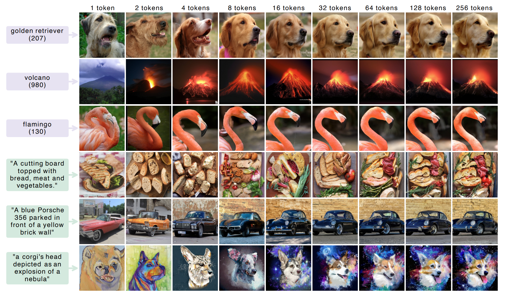

# Autoregressive models trained on FlexTok tokenizer

This repository provides inference code and a model zoo for running text-to-image and class-to-image autoregressive models trained with the [FlexTok](https://github.com/apple/ml-flextok) tokenizer. In this repository, we refer to these models as FlexTok AR or FlexAR for short. This model family serves as the primary backbone in our test-time search experiments.

This repository is built on [FlexTok](https://github.com/apple/ml-flextok) tokenizer and the [L3M](https://github.com/apple/ml-l3m) framework. It can be used **standalone** (image generation only) or as part of the full [SoT framework](../README.md) (test-time search).


>  Image generation examples with varying numbers of tokens from the FlexTok AR model. Figure from [FlexTok Paper](https://arxiv.org/pdf/2502.13967).

## Table of Contents

- [Installation](#installation)
- [Quick Start](#quick-start)
  - [CLI](#cli)
  - [Jupyter Notebook](#jupyter-notebook)
  - [Python API](#python-api)
- [Model Zoo](#model-zoo)
- [Generation Parameters](#generation-parameters)

---

## Installation

### Standalone (FlexTok AR only)

```bash
conda create -n flextok_ar python=3.10 -y
conda activate flextok_ar

cd flextok_ar
pip install -e .
```

This automatically installs [FlexTok](https://github.com/apple/ml-flextok), [L3M](https://github.com/apple/ml-l3m), PyTorch, and other required dependencies.

### As part of SoT

See the [main README](../README.md#installation) for the full SoT installation.

---

## Quick Start

### CLI

```bash
# Text-to-image: basic usage
python generate.py --mode t2i \
    --model-id EPFL-VILAB/FlexAR-3B-T2I \
    --prompt "A serene lake at sunset with mountains" \
    --output lake.png

# Class-to-image (ImageNet class)
python generate.py --mode c2i \
    --model-id EPFL-VILAB/FlexAR-1B-C2I \
    --class-label 285 \
    --output cat.png
```

**Available options:**

| Option | Default | Description |
|--------|---------|-------------|
| `--mode` | — | `t2i` (text-to-image) or `c2i` (class-to-image) |
| `--model-id` | — | HuggingFace model ID (see [Model Zoo](#model-zoo)) |
| `--prompt` | — | Text description (required for `t2i`) |
| `--class-label` | 285 | ImageNet class 0–999 (for `c2i`) |
| `--output` | — | Output path (use `{i}` for multiple samples) |
| `--num-samples` | 1 | Number of images to generate|
| `--cfg-factor` | 3.0 / 1.5 | Guidance scale (default: 3.0 for t2i, 1.5 for c2i) |
| `--temperature` | 1.0 | Sampling temperature |
| `--seed` | — | Random seed |
| `--device` | `cuda:0` | Device |

### Jupyter Notebook

See [`flextok_ar_inference.ipynb`](flextok_ar_inference.ipynb) for interactive examples covering text-to-image and class-to-image generation.

### Python API

```python
from flextok_ar.utils.helpers import load_model

# Load a FlexTok AR model from HuggingFace Hub
model, tokenizer, cfg = load_model(
    model_id="EPFL-VILAB/FlexAR-3B-T2I",
    device="cuda"
)

# Generate from text
data_dict = {"text": ["A golden retriever playing in snow"]}
images = model.generate(data_dict, cfg_factor=3.0, temperature=1.0)

# Save
from torchvision.utils import save_image
save_image((images + 1.0) / 2.0, "output.png")
```

Models can also be loaded from a local directory:

```python
model, tokenizer, cfg = load_model(
    model_id="/path/to/downloaded/model",  # must contain model.safetensors and config.yaml
    device="cuda"
)
```

---

## Model Zoo

FlexTok AR checkpoints are hosted on HuggingFace.

> **Note:** Weights are currently under [`ZhitongGao`](https://huggingface.co/ZhitongGao) and will be moved to the [`EPFL-VILAB`](https://huggingface.co/EPFL-VILAB) organization upon public release.

### Text-to-Image (T2I)

| Model | Resolution | Tokens | Params | HuggingFace |
|-------|-----------|--------|--------|-------------|
| FlexAR-113M | 256×256 | 256 | 113M | [`EPFL-VILAB/FlexAR-113M-T2I`](https://huggingface.co/EPFL-VILAB/FlexAR-113M-T2I) |
| FlexAR-382M | 256×256 | 256 | 382M | [`EPFL-VILAB/FlexAR-382M-T2I`](https://huggingface.co/EPFL-VILAB/FlexAR-382M-T2I) |
| FlexAR-1B | 256×256 | 256 | 1.15B | [`EPFL-VILAB/FlexAR-1B-T2I`](https://huggingface.co/EPFL-VILAB/FlexAR-1B-T2I) |
| FlexAR-3B | 256×256 | 256 | 3.06B | [`EPFL-VILAB/FlexAR-3B-T2I`](https://huggingface.co/EPFL-VILAB/FlexAR-3B-T2I) |
| GridAR-3B | 256×256 | 256 | 3.06B | [`EPFL-VILAB/GridAR-3B-T2I`](https://huggingface.co/EPFL-VILAB/GridAR-3B-T2I) |

All T2I models use 256 FlexTok tokens at 256×256 resolution. Larger models produce higher quality images; FlexAR-113M is fastest for experimentation and ablations.

### Class-to-Image (C2I)

| Model | Resolution | Tokens | Params | HuggingFace |
|-------|-----------|--------|--------|-------------|
| FlexAR-1B | 256×256 | 256 | 1.15B | [`EPFL-VILAB/FlexAR-1B-C2I`](https://huggingface.co/EPFL-VILAB/FlexAR-1B-C2I) |

The C2I model generates images conditioned on ImageNet class labels (0–999). Use `--cfg-factor 1.5` (default) for class-to-image generation.

---

## Generation Parameters

| Parameter | Default | Description |
|-----------|---------|-------------|
| `cfg_factor` | 3.0 (t2i) / 1.5 (c2i) | Classifier-free guidance scale. Higher = more prompt-faithful |
| `temperature` | 1.0 | Sampling temperature. Lower = more deterministic |
| `top_k` | 0 | Top-k filtering (0 = disabled) |
| `top_p` | 0.0 | Nucleus sampling (0 = disabled) |
| `num_keep_tokens` | 256 | Number of tokens to generate |
| `timesteps` | 25 | FlexTok decoder flow-matching steps |
| `tokenizer_cfg_factor` | 7.5 | CFG scale for the FlexTok decoder |

---